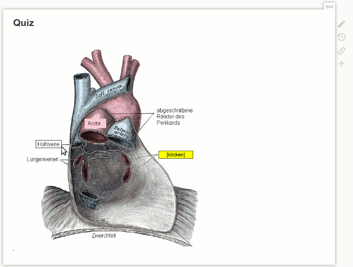

# DokuWiki-Plugin: PictureQuiz

Cover up parts of an image which can be uncoverd per click.



## Usage

The coding area must be enclosed with the ``<picturequiz>...</picturequiz>``-Tags.

The following options can be used:
* ``image:`` - image file (in DokuWiki-syntax)
* ``button: `` - draws a button (rectangle) between the stated coordinates
* ``edit_mode`` - display a helping text area to design buttons - optional
* ``hide_button`` - hide text over buttons - options

Example:

```
<picturequiz>
image: wiki:example.png

button: [x],[y],[x2],[y2]

edit_mode

hide_button_text

</picturequiz>
```

## Compatibility

Tested with
* PHP **7.3**
* DokuWiki / **Hogfather**

## Ideas

* Code CleanUp
* Translations
* ``source:``-Tag

### Store Medadata in a png file?

Ideas / Inspiration:
* https://stackoverflow.com/questions/25528264/appending-a-png-phys-chunk-in-php/46541839#46541839
